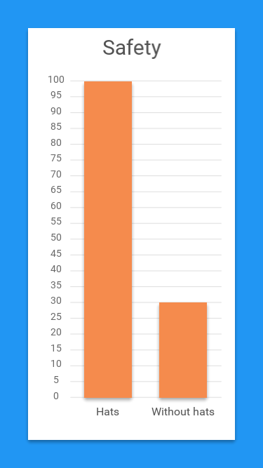

# Bar chart

This example shows how we can create bar charts using the premium Fuse.Charting API.

## Preparation

In order to use the library, you have to install it. This is done by running the following command from the commandline:

```
uno install Fuse.Charting
```

With that done, you should be all set. Remember to include `Fuse.Charting` package in your unoproj file, like it is done in this example:

```
"Packages": [
    [...]
    "Fuse.Charting"
  ],
```

## The bars

Bars are rendered using Rectangles, like so:

	<Panel Row="0" Column="1">
		<c:PlotData>
			<c:PlotArea YStepSize="20"/>
			<c:PlotBar>
				<Rectangle Color="#f58b4d" Height="100%" Alignment="Bottom" Margin="20,0,20,0">
					<Shadow />
				</Rectangle>
			</c:PlotBar>
		</c:PlotData>
	</Panel>

The `Panel` is there for layout-reasons, to make sure the rectangles are in the correct grid, as the `Plot` uses a `GridLayout`. Also worth noting is `PlotArea`, which is used to configure certain aspects of the `PlotData` behavior. In this example, `PlotArea` is used to define the maximum number of steps on the y-axis, which is 20 in this case.

## Various cosmetics

Since this is a bar chart, labels on the x-axis describing the bars is normally expected. This is done using `PlotAxis`:

	c:PlotAxis Row="1" Column="1" Axis="X" >
		<Text ux:Template="Label" Value="{Plot axis.label}" Alignment="Center"/>
	</c:PlotAxis>

Additionally, y-axis labels are used to make the chart more readable:

	<c:PlotAxis Row="0" Column="0" Axis="Y">
	    <Text ux:Template="Label" TextAlignment="Center" FontSize="14" Color="#666"
	        Value="{Plot axis.value}"/>
	</c:PlotAxis>

Last, horizontal lines are drawn like this:

	<c:PlotTicks Axis="Y" StrokeWidth="1" StrokeColor="#DDD" Row="0" Column="1" />


