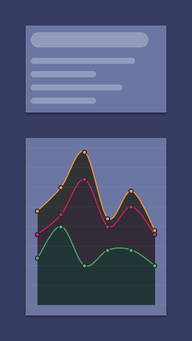

# Line graph 

This example shows how you can create simple, but good looking graphs using the premium Fuse.Charting library. In this example, we will create a reusable line-graph renderer, which will be used to draw 3 similar graphs on top of each other.

## Preparation

In order to use the library, you have to install it. This is done by running the following command from the commandline:

```
uno install Fuse.Charting
```

With that done, you should be all set. Remember to include `Fuse.Charting` package in your unoproj file, like it is done in this example:

```
"Packages": [
    [...]
    "Fuse.Charting"
  ],
```

## The line-graph renderer

The line-graph renderer should function as a `ux:Class` we can place inside a `Plot` element, acting as a shortcut to a styled line graph. We are therefore interested in adding a few properties so we get more control over the graph:

	<Panel ux:Class="MyPlot">
		<int ux:Property="SeriesIndex" />
		<float4 ux:Property="MainColor" />
		<float4 ux:Property="BackgroundColor" />

One property of interest, is `SeriesIndex`. If you provide multiple `DataSeries` to a `Plot`, you can use the `SeriesIndex` on a `PlotData` element to select which data series you are drawing from. By exposing the `SeriesIndex` as a property, followed by binding to it using `ReadProperty`(see below), we can control what data series our renderer is reading from.

Our line-graph renderer should take a `DataSeries`, and display the data in a nice and consistent way. We can do this using `PlotData`. `PlotData` is like `Each`, but works on every point of data in the `Plot` we are drawing on. Using this, we can place our dot and curve elements in the UX hierarchy, and further draw a graph:


	<Curve StrokeWidth="2" StrokeColor="{ReadProperty MainColor}" Close="None">
		<c:PlotData SeriesIndex="{ReadProperty SeriesIndex}">
			<c:PlotCurvePoint />
			<c:PlotPoint>
				<Circle Color="{ReadProperty MainColor}" Width="10" Height="10">
					<Stroke Width="2" Color="#202B33" Alignment="Outside" />
				</Circle>
			</c:PlotPoint>
		</c:PlotData>
	</Curve>

Notice how the `PlotData` element is inside a `Curve` element. This is because we want to place PlotCurvePoints on a curve, in order to build its shape. Due to `PlotData` being what provides the data, this also means we have to place `PlotPoint` inside the `Curve`. This is safe however, as `PlotPoint` doesn't interfere with the layout of `Curve`.

In addition to drawing a curve from our plot data, we want to extrude it downwards. This can be done using the `Extrude` property on `Curve`, like so:

	<Curve Close="None" Extrude="Bottom">
		<SolidColor Color="{ReadProperty BackgroundColor}" />
		<c:PlotData SeriesIndex="{ReadProperty SeriesIndex}">
			<c:PlotCurvePoint />
		</c:PlotData>
	</Curve>

## Putting it together

With a line-graph renderer done, we can make a `Plot` element, and use it to pipe some test data to three line-graph renderers:

	<c:Plot >
		<c:DataSeries Data="{values1}" />
		<c:DataSeries Data="{values2}" />
		<c:DataSeries Data="{values3}" />

		<GridLayout Rows="1*,20" />

		<Panel Row="0">
			<c:PlotTicks Axis="Y" StrokeWidth="1" StrokeColor="#d0d0d019" />
		</Panel> 

		<MyPlot Row="0" MainColor="#48B66A" BackgroundColor="#213536" SeriesIndex="0" />
		<MyPlot Row="0" MainColor="#E6175D" BackgroundColor="#322B38" SeriesIndex="1" />
		<MyPlot Row="0" MainColor="#FF993B" BackgroundColor="#303334" SeriesIndex="2" />

	</c:Plot>

There are a few things happening here. First, we provide the `Plot` with our datasets using the `DataSeries` tag. These are selected using the `SeriesIndex` property mentioned earlier. The first `DataSeries` gets the index 0, the next 1, and so on...

Next, some layout stuff. `Plot` doesn't have a default layout, so the most common thing to do is to use a `GridLayout`, as it allows for easy sizing of different areas of the graph. In this case, we are telling it to reserve 20 pixels at the bottom, which could be used for labels for the X-axis. However, in this example, it is only used cosmetically. Next, `PlotTicks` are used. `PlotTicks` produces sane lines or ticks that help give your `Plot` a sense of proportions. In this example, it generates thin lines horizontally.

Last but not least, we use our line-graph renderer which we described earlier to actually draw the graphs. Notice that we are providing data for the properties we described earlier.

That's it! As you can see, the premium `Fuse.Charting` provides a quick and easy way to show charts in your apps.

