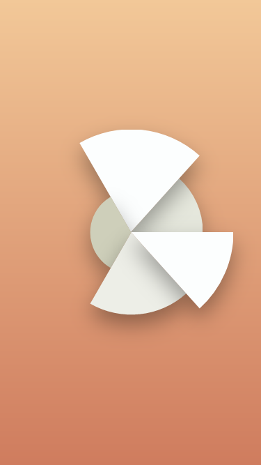

# Pie Chart

This example shows how you can create simple, but good looking graphs using the premium Fuse.Charting library. In this example, we will create a reusable line-graph renderer, which will be used to draw 3 similar graphs on top of each other.

## Preparation

In order to use the library, you have to install it. This is done by running the following command from the commandline:

```
uno install Fuse.Charting
```

With that done, you should be all set.

## Drawing the slices

Slices are drawn using `PlotWedge`, like so:

	<c:PlotData >
		<Panel ux:Name="me" Width="{Plot data.object}.sizePercent" Height="{Plot data.object}.sizePercent">
			<c:PlotWedge ux:Name="meCircle" Color="(((1 - {{Plot data.object}.size/100}) * #b0b08C) + (({{Plot data.object}.size/100}) * #FCFEFE))" HitTestMode="LocalVisual" />
		</Panel>
	</c:PlotData>

UX expressions are used to color the wedges based on size, and an outer `Panel` is used to size the wedge based on size.

